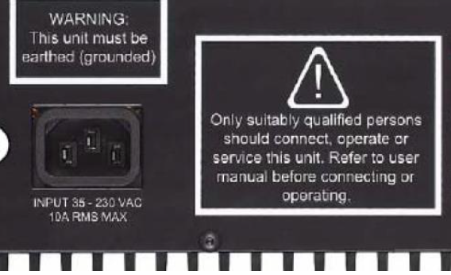
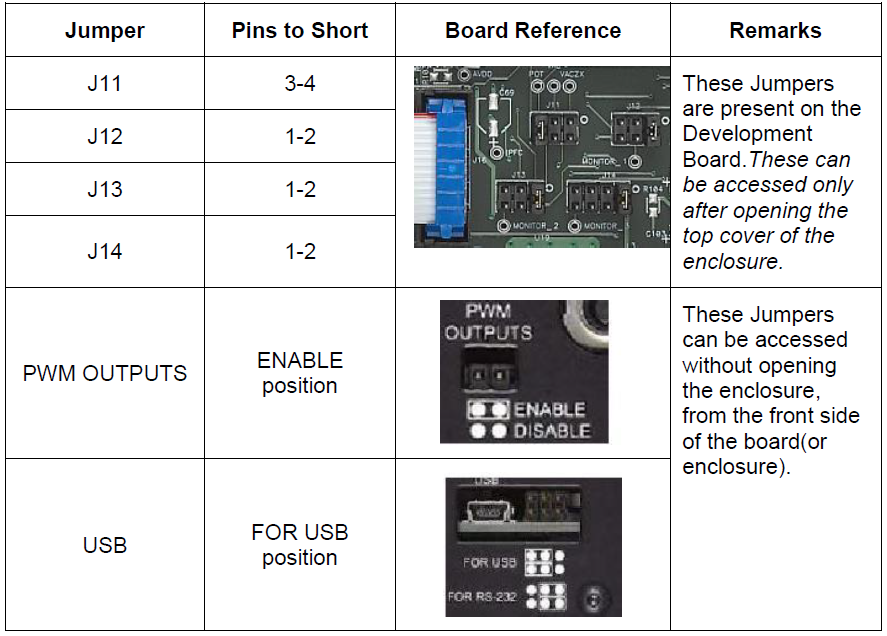
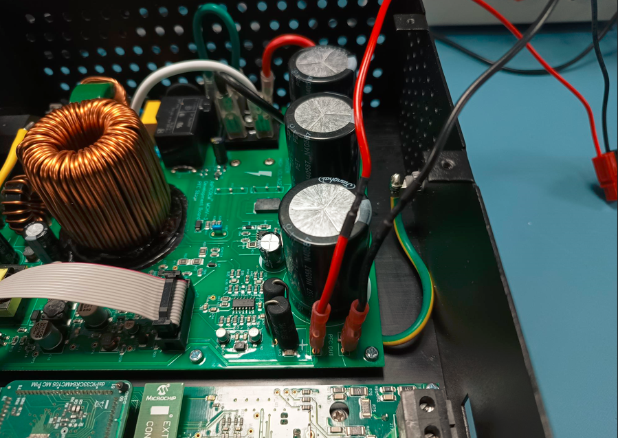
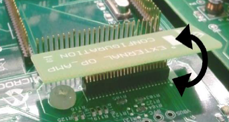
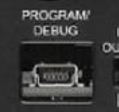
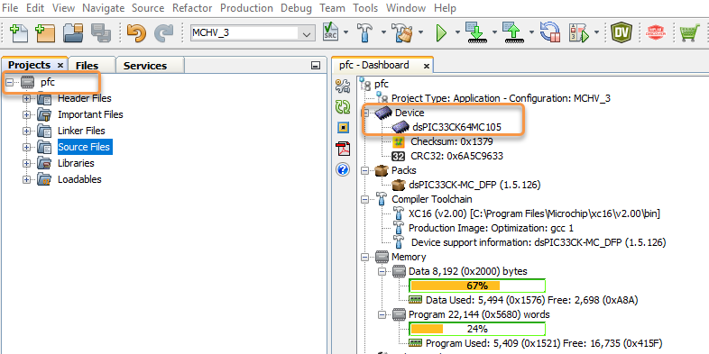
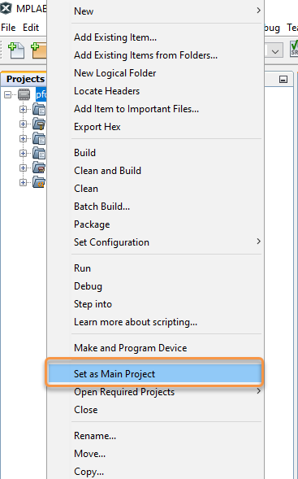

 
## Single Stage Boost Power Factor Correction Demonstration: dsPICDEM™ MCHV-3 Development Board and dsPIC33CK64MC105 External Op-Amp Motor Control PIM

## 1. INTRODUCTION
This document describes the setup requirements for single stage boost power factor correction algorithm on the hardware platform dsPICDEM™ MCHV-3 Development Board in the External Op-Amp configuration with the dsPIC33CK64MC105 External Op-Amp Motor Control Plug-In Module (PIM).
 

## 2. SUGGESTED DEMONSTRATION REQUIREMENTS

### 2.1 PFC Application Firmware Required for the Demonstration

To clone or download this application firmware on GitHub, 
- Navigate to the [main page of this repository](https://github.com/microchip-pic-avr-solutions/mchv3-dspic33ck64mc105-pfc) and 
- On the tab **<> Code**, above the list of files in the right-hand corner, click Code, then from the menu, click **Download ZIP** or copy the repository URL to **clone.**
> **Note:** 
>In this document, hereinafter this firmware package is referred as **firmware.**
### 2.2 Software Tools Used for Testing the firmware

- MPLAB® X IDE **v6.00** 
- DFP: **dsPIC33CK-MC_DFP v1.5.126**
- MPLAB® XC16 Compiler **v2.00**
- MPLAB® X IDE Plugin: **X2C-Scope v1.3.3** 
> **Note:**  
>The software used for testing the firmware prior to release is listed above. It is recommended to use the version listed above or later versions for building the firmware.
### 2.3 Hardware Tools Required for the Demonstration

- dsPICDEM™ MCHV-3 Development Board ([DM330023-3](https://www.microchip.com/en-us/development-tool/dm330023-3))
- dsPIC33CK64MC105 External Op-Amp Motor Control PIM([MA330051](https://www.microchip.com/en-us/development-tool/MA330051-1))
- Bulb load

> **Note:**  
> All items listed under the section Hardware Tools Required for the Demonstration are available at [microchip DIRECT](https://www.microchipdirect.com/)

 

## 3. HARDWARE SETUP
This section describes hardware setup required for the demonstration. 

Refer dsPICDEM™ MCHV-3 Development Board User’s Guide, for any clarification while setting up the hardware.

1. Before making any connection, verify that the Development Board is not powered and it is fully discharged. This can be done by checking if Power on Status LED D13(Red) is off.

2. Unplug the power cord connected to the board . Ensure that the supply is discharged by monitoring the LED D13(Red).
     

     

3. When the LED is turned off, open the top cover of the enclosure and measure the DC Bus voltage across the terminals which reads approximately '0 VDC'.
If the voltage is greater than 1V, wait until it is completely discharged and then follow the steps from 2.
4. Set up the following jumpers as follows:
     

     

5. Disconnect the wires to the inverter board and  connect the wires from the bulb load to terminals of connector, provided on the Development Board.

     

     

6.	Insert the ‘External Op-Amp configuration Matrix board’ into matrix board header J4. Ensure the matrix board is correctly oriented before proceeding.

     

     

7. Insert the dsPIC33CK64MC105 External Op-Amp Motor Control PIM into the PIM Socket U11 provided on the Development Board. Make sure the PIM is correctly placed and oriented before proceeding.

8. Close the top cover of the enclosure and secure it with screws.

9. To program the device, a mini-USB connection is required between Host PC and the Development Board. Connect a mini-USB cable from your computer to the mini-USB connector “PROGRAM/DEBUG” of the Development Board. The development board features a built-in isolated Programmer or Debugger.
     

     

10. Plug the female terminal of the power cable to the AC input connector J1 and power-up the development board. To verify the unit is powered, make sure LEDs D6, D13, D16 and D18 are ON.
 
  

## 4. SOFTWARE SETUP AND RUN
### 4.1 Setup: MPLAB X IDE and MPLAB XC16 Compiler
Install **MPLAB X IDE** and **MPLAB XC16 Compiler** versions that support the device **dsPIC33CK64MC105** and **PKOBv4.** The MPLAB X IDE, MPLAB XC16 Compiler, and X2C-Scope plug-in used for testing the firmware are mentioned in the [PFC Application Firmware Required for the Demonstration](#21-pfc-application-firmware-required-for-the-demonstration) section. 

To get help on  

- MPLAB X IDE installation, refer [link](https://microchipdeveloper.com/mplabx:installation)
- MPLAB XC16 Compiler installation steps, refer [link](https://microchipdeveloper.com/xc16:installation)

If MPLAB IDE v8 or earlier is already installed on your computer, then run the MPLAB driver switcher (Installed when MPLAB®X IDE is installed) to switch from MPLAB IDE v8 drivers to MPLAB X IDE drivers. If you have Windows 8 or 10, you must run the MPLAB driver switcher in **Administrator Mode**. To run the Device Driver Switcher GUI application as administrator, right-click on the executable (or desktop icon) and select **Run as Administrator**. For more details, refer to the MPLAB X IDE help topic **“Before You Begin: Install the USB Device Drivers (For Hardware Tools): USB Driver Installation for Windows Operating Systems.”**

### 4.2 Setup: X2C-SCOPE
X2C-Scope is an MPLAB X IDE plugin that allows developers to interact with an application while it runs. X2C-Scope enables you to read, write, and plot global variables (for motor control) in real-time. It communicates with the target using the UART. To use X2C-Scope, the plugin must be installed. To set up and use X2C-Scope, refer to the instructions provided on the [web page](https://x2cscope.github.io/docs/MPLABX_Plugin.html).

## 5.  BASIC DEMONSTRATION
### 5.1 Firmware Description
The firmware version needed for the demonstration is mentioned in the section [PFC Application Firmware Required for the Demonstration](#21-pfc-application-firmware-required-for-the-demonstration) section. This firmware is implemented to work on Microchip’s 16-bit Digital signal controller (dsPIC® DSC) **dsPIC33CK64MC105**. For more information, see the **dsPIC33CK64MC105 Family datasheet (DS70005399)**.

> **Note:** 
> The project may not build correctly in Windows OS if the Maximum path length of any source file in the project is more than 260 characters. In case the absolute path exceeds or nears the maximum length, do any (or both) of the following:
> - Shorten the directory name containing the firmware used in this demonstration. If you renamed the directory, consider the new name while reading the instructions provided in the upcoming sections of the document.
> - Place firmware in a location such that the total path length of each file included in the projects does not exceed the Maximum Path length specified.  
> Refer to MPLAB X IDE help topic **“Path, File, and Folder Name Restrictions”** for details. 

### 5.2 Basic Demonstration
Follow the below instructions, step by step, to set up and run the PFC demo application:

1. Start **MPLAB X IDE** and open the project **pfc.X (File > Open Project)** with device selection **dsPIC33CK64MC105.**   
     

     
 

2. Set the project **pfc.X** as the main project by right-clicking on the project name and selecting **Set as Main Project** as shown. The project **pfc.X** will then appear in **bold.**    
     

     

	
3. Open <code>**pfc_userparams.h** </code> (**pfc.X > Header Files**) in the project **pfc.X.**  
     - Ensure that the macros <code>**ENABLE_PFC</code>, <code>PFC_POWER_CONTROL</code>** are defined in the header file<code> **pfc_userparams.h.**</code>         
          

          

          

          

     - Ensure that the parameters values are set for dsPICDEM™ MCHV-3 Development Board.
> **Note:** 
>Note: Rated current of the board in External op amp configuration is 21.3 A.
 

4. Right-click on the project **pfc.X** and select **Properties** to open its **Project Properties** Dialog. Click the **Conf:[MCHV_3]** category to reveal the general project configuration information. The development tools used for testing the firmware are listed in section [2.2 Software Tools Used for Testing the firmware](#22-software-tools-used-for-testing-the-firmware)

     In the **Conf:[MCHV_3]** category window: 
     - Ensure the selected **Device** is **dsPIC33CK64MC105.**
     - Select the **Connected Hardware Tool** to be used for programming and debugging. 
     - Select the specific Device Family Pack (DFP) from the available list of **Packs.** In this case, **dsPIC33CK-MC_DFP 1.5.126** is selected. 
     - Select the specific **Compiler Toolchain** from the available list of **XC16** compilers. 
     In this case, **XC16(v2.00)** is selected.
     - After selecting Hardware Tool and Compiler Toolchain, Device Pack, click the button **Apply**.

     - Please ensure that the selected MPLAB® XC16 Compiler and Device Pack support the device configured in the firmware.
          

          

5. Ensure that the checkbox **Load symbols when programming or building for production (slows process)** is checked under the **Loading** category of the **Project Properties** window.              
     

     

6. To build the project (in this case, **pfc.X**) and program the device dsPIC33CK64MC105, click **Make and Program Device Main project** on the toolbar
     

     
 

## 5.3  Data visualization through X2C-Scope Plug-in of MPLAB X

X2C-Scope is a third-party plug-in in MPLAB X, which helps in real-time diagnostics. The application firmware comes with the initialization needed to interface the controller with the host PC to enable data visualization through the X2C-Scope plug-in. Ensure the X2C-Scope plug-in is installed. For more information on how to set up a plug-in, refer to either the [Microchip Developer Help page](https://microchipdeveloper.com/mplabx:tools-plugins-available) or the [web page.](https://x2cscope.github.io/docs/MPLABX_Plugin.html)
 
1. To establish serial communication with the host PC, connect a micro-USB cable between the host PC and **connector J6** on the  dsPICDEM™ MCHV_3 Development Board.

2. Ensure the application is configured and running as described under section [5.2 Basic Demonstration](#52-basic-demonstration) by following steps 1 through 8.

3. Open the **X2C-Scope** window by selecting **Tools>Embedded>X2CScope.**
     

     

4. **In the X2C-Scope Configuration** window, open the **Connection Setup** tab and click **Select Project.** This opens the drop-down menu **Select Project** with a list of opened projects. Select the specific project **pfc** from the list of projects and click **OK**.    
    

    

5. To configure and establish the serial communication for **X2C-Scope**, open the **X2CScope Configuration** window, click on the **Connection Setup** tab and:
     - Set **Baudrate** as **115200**, which is configured in the application firmware. 
     - Click on the **Refresh** button to refresh and update the list of the available Serial COM ports connected to the Host PC. 
     - Select the specific **Serial port** detected when interfaced with the dsPICDEM™ MCHV-3 Development Board. The **Serial port** depends on the system settings
          

          

 
6. Once the **Serial port** is detected, click on **Disconnected** and turn to **Connected**, to establish serial communication between the Host PC and the board.
     

     

7. Open the **Project Setup** tab in the **X2CScope Configuration** window and,
     - Set **Scope Sampletime** as the interval at which <code>X2CScopeUpdate()</code> is called. In this application, it is every <code>50µs.</code> 
     - Then, click **Set Values** to save the configuration.
          

          

8. Click on **Open Scope View** (in the **Data Views** tab of the **X2CScope Configuration** Window); this opens **Scope Window.**
     

     

    	     
9. In the **Scope Window**, select the variables that must be watched. To do this, click on the **Source** against each channel, and a window **Select Variables** opens on the screen. From the available list, the required variable can be chosen. Ensure checkboxes **Enable** and **Visible** are checked for the variables to be plotted.
To view data plots continuously, uncheck **Single-shot.** When **Single-shot** is checked, it captures the data once and stops. The **Sample time factor** value multiplied by **Sample time** decides the time difference between any two consecutive data points on the plot.
    

    

10.	Click on **SAMPLE**, then the X2C-Scope window plots variables in real-time, which updates automatically.
     

     

 

11.	Click on **ABORT** to stop.
     

     

 
 ## 6. REFERENCES:
For additional information, refer following documents or links.
1. AN1106 Application Note “[Power Factor Correction in Power Conversion Applications
Using the dsPIC® DSC](https://ww1.microchip.com/downloads/en/Appnotes/01106A.pdf)”
2. dsPICDEM™ MCHV-3 Development Board User’s Guide [(DS50002505)](https://ww1.microchip.com/downloads/aemDocuments/documents/OTH/ProductDocuments/UserGuides/DS50002505a.pdf) 
3. dsPIC33CK64MC105 External Op-Amp Motor Control PIM Information Sheet[(DS50002925)](http://ww1.microchip.com/downloads/en/DeviceDoc/dsPIC33CK64MC105%20Motor%20Control%20Plug-In%20Module%20(PIM)%20Information%20Sheet%20for%20External%20Op%20Amp%20Configuration%20DS-50002925a.pdf)
4. dsPIC33CK64MC105 Family datasheet [(DS70005399)](https://ww1.microchip.com/downloads/en/DeviceDoc/dsPIC33CK64MC105-Family-Data-Sheet-DS70005399C.pdf)
5. [Family Reference Manuals (FRM) of dsPIC33CK64MC105 family](https://www.microchip.com/en-us/product/dsPIC33CK64MC105#document-table)
6. MPLAB® X IDE User’s Guide (DS50002027) or MPLAB® X IDE help
7. [MPLAB® X IDE installation](http://microchipdeveloper.com/mplabx:installation)
8. [MPLAB® XC16 Compiler installation](http://microchipdeveloper.com/xc16:installation)
9. [Installation and setup of X2Cscope plugin for MPLAB X](https://x2cscope.github.io/docs/MPLABX_Plugin.html)

